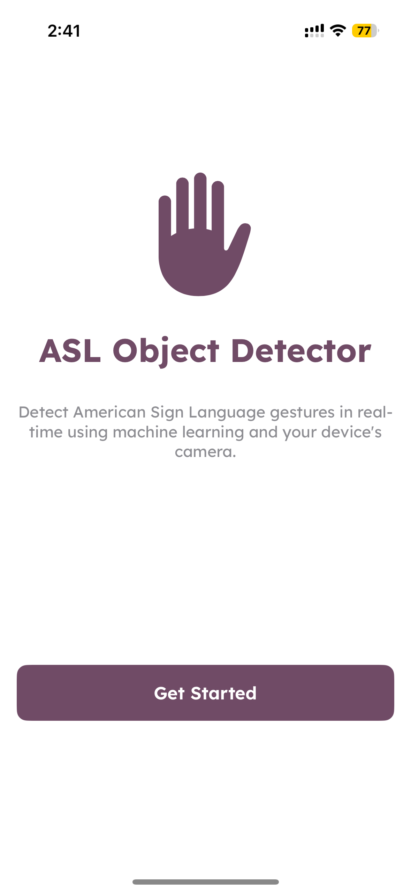
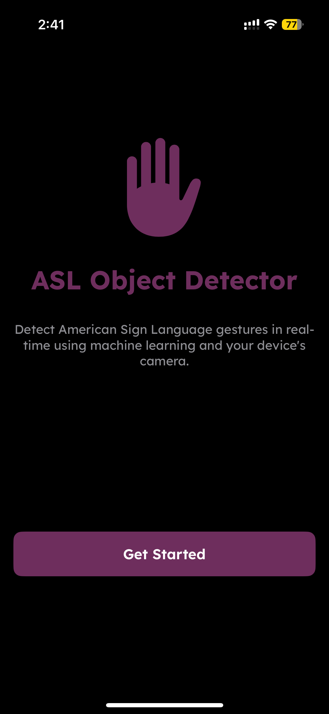
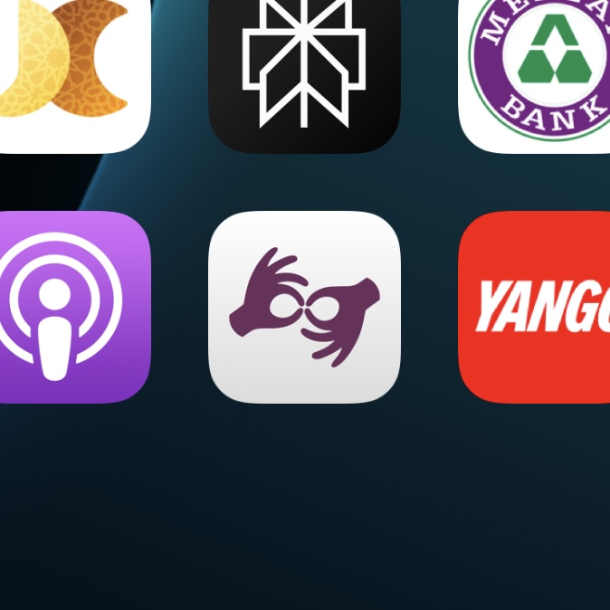
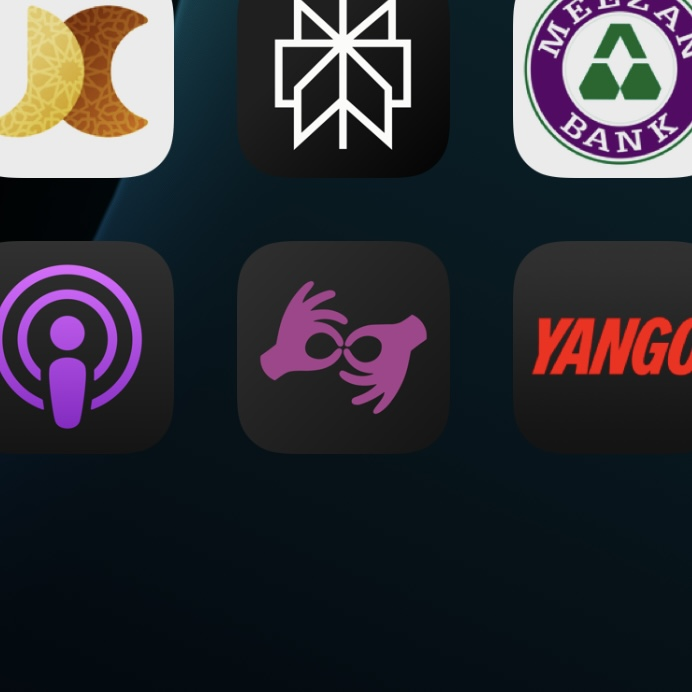
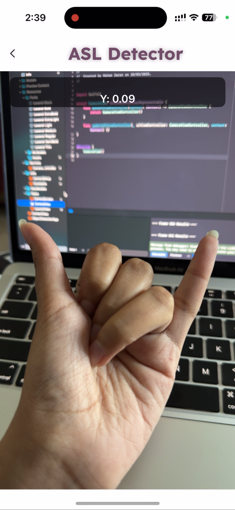

# 📱 iOS ObjectDetection 

A real-time object detection iOS app built using **Swift**, **Core ML**, and **Create ML**. This app uses a YOLOv2-based model to recognize American Sign Language (ASL) gestures directly from the device's camera — no internet required!

### 🚀 Features

- 🎥 Real-time camera input using `AVFoundation`
- 🧠 Custom-trained **YOLOv2** model using **Create ML**
- 🧾 ASL classifier trained on 26 alphabet classes
- ⚙️ Works on-device with CoreML (no server dependency)

---

### 🖼 Screenshots

| Launch View (Light) | Launch View (Dark) |
|---------------------|--------------------|
|  |  |

| App Icon (Light) | App Icon (Dark) |
|------------------|-----------------|
|  |  |

<h4 align="center">📸 Detection Screen</h4>

  

---

### 🎞 Demo
In the Screenshots directory called `Demo.MP4`.

---

### 🛠 How It Was Built

| Stack | Details |
|-------|---------|
| **Model** | YOLOv2 (Object Detection) trained in **Create ML** |
| **Languages** | Swift (SwiftUI + UIKit integration) |
| **Frameworks** | Core ML, Vision, AVFoundation |
| **Architecture** | MVVM + SwiftUI views + UIKit camera controller |

#### ✏️ Create ML Workflow:
1. Labeled training data with bounding boxes for ASL signs.
2. Trained using Create ML’s object detection template (YOLOv2).
3. Exported as `.mlmodel` and added to the Xcode project.

---

### 📚 Requirements

- macOS 12.0+
- Xcode 14.0+
- iOS 15.0+ device (with camera access)
- Apple Silicon strongly recommended for Create ML training

---

#### - Maham 👩🏻‍💻
